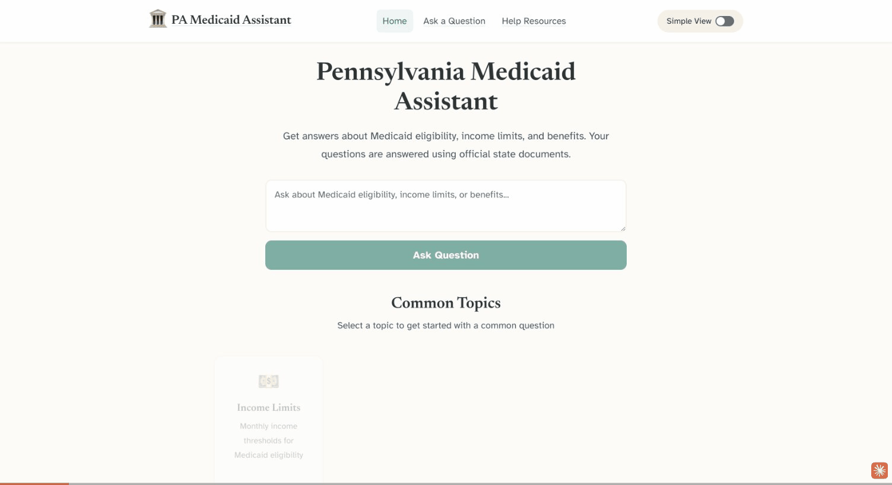

# PA Medicaid Assistant - E2E Demo

End-to-end demonstration of the Pennsylvania Medicaid Assistant application through real-world persona scenarios.

## Quick Demo

*Basic walkthrough: Home page, Ask a Question, Query submission, Response views, Help Resources*

## Overview

The PA Medicaid Assistant is a RAG-based Q&A system that helps users find information about Pennsylvania Medicaid eligibility, income limits, and benefits. All answers are sourced from official state documents.

**Target Users:**
- **Senior Citizens** - Individuals 65+ navigating Medicare and Medicaid benefits
- **Adult Children/Caregivers** - Family members helping elderly parents with healthcare decisions

## Persona Demonstrations

*34-frame animated demo showing real-world questions from both personas*

### Persona 1: Senior Citizen (Margaret, 72)

Margaret is a 72-year-old widow living on Social Security, trying to understand what help is available to reduce her healthcare costs.

**Q: "I'm 72 and on a fixed income. Can Medicaid help pay my Medicare Part B premium?"**

> Yes, Medicaid can help pay your Medicare Part B premium if you meet certain eligibility criteria. You must be at least 65 years old and have a low income as defined by the Federal Poverty Income Guidelines (FPIG). The Medical Assistance program in Pennsylvania includes a coverage plan designed to assist elderly individuals or those with disabilities who are eligible for Medicare in paying some or all of their Medicare premiums.
>
> *Source: PA Medical Assistance Program documentation*

**Q: "My prescriptions cost too much. What programs help seniors pay for medications in PA?"**

> The Pennsylvania Pharmaceutical Assistance Contract for the Elderly (PACE) Program offers low-cost prescription medication to qualified residents age 65 and older. This program covers all medications requiring a prescription within the Commonwealth of Pennsylvania, including insulin, insulin syringes, and insulin needles.
>
> *Source: PA-PACE-PACENET-Provider-Guide-2025*

### Persona 2: Adult Child Caregiver (David, 48)

David is helping his 78-year-old mother navigate long-term care options, researching what Medicaid covers and alternatives to nursing home placement.

**Q: "My mom needs nursing home care but we can't afford it. Does Medicaid cover nursing homes?"**

> Yes, Medicaid may cover nursing home care for individuals who meet certain eligibility criteria and income limits. However, if you are receiving nursing facility or home and community-based services through the Medical Assistance program, you may have to give some or most of your income toward the cost each month. Medicaid will not pay for care in a nursing home unless it is determined that such care is medically necessary.
>
> *Source: PA-DHS-Estate-Recovery-FAQ*

**Q: "My dad wants to stay home instead of going to a nursing home. What is the LIFE program?"**

> I cannot find this information in the provided documents.

*Note: This demonstrates the system's transparency when information isn't available. Users are encouraged to call PHLP at 1-800-274-3258 for questions not covered in the knowledge base.*

## Application Features

### Home Page
- Main search input for direct questions
- Navigation to Ask a Question and Help Resources
- Simple/Detailed View toggle
- Common Topics quick-start cards (Income Limits, Medicare Savings, Long-Term Care, Prescription Help)

### Response Views

| Feature | Simple View | Detailed View |
|---------|-------------|---------------|
| Answer text | Yes | Yes |
| Citations | Hidden | Visible |
| Source Information | Hidden | Visible |
| Sources list | Hidden | Expandable |

### Help Resources

| Organization | Phone |
|-------------|-------|
| Pennsylvania Health Law Project (PHLP) | 1-800-274-3258 |
| Elder Law Attorney Referral | 1-800-932-0311 |
| PA Legal Aid Network | 1-800-322-7572 |
| Chester County CAO | 610-466-1000 |
| APPRISE Medicare Counseling | 610-344-6350 |

## Technical Stack

- **Vector Database:** Qdrant
- **LLM:** LM Studio (local inference)
- **Retrieval:** Hybrid search (vector + keyword fusion)
- **Data Sources:** PA DHS documents, PHLP guides, OIM memoranda, PA Bulletin notices

## Demo Files

| File | Description |
|------|-------------|
| `pa-medicaid-assistant-demo.gif` | Basic application walkthrough (13 frames, 1.7 MB) |
| `pa-medicaid-assistant-personas-demo.gif` | Full persona scenarios (34 frames, 5.7 MB) |

---
*Demo captured January 3, 2026*
